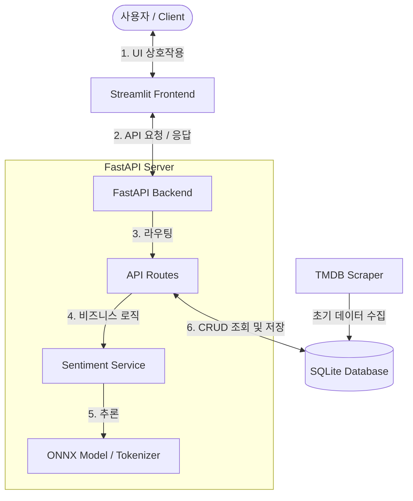

# Mission 18: 영화 정보 및 리뷰 감정 분석 미션

## MVP 서비스 구현
- backend: FastAPI
- frontend: Streamlit
- database: sqlite
- ORM: SQLModel

## 의존성 설치 및 서비스 실행
### Dependencies
- python>=3.11.15
- fastapi>=0.142.2
- httpx>=0.28.1
- numpy>=2.4.6
- onnx>=1.23.1
- onnxruntime>=1.30.0
- pydantic>=2.13.5
- pydantic-settings>=2.15.0
- requests>=2.34.2
- sqlmodel>=0.0.47
- streamlit>=1.65.0
- transformers>=5.18.0
- uv>=0.12.19

### 설치
```bash
# uv 설치
pip install uv

# 의존성 설치
uv sync
```
### 실행
- backend
```bash
uv run uvicorn src.m18.backend.main:app --reload --port 8000
```
- frontend
```bash
uv run streamlit run src/m18/frontend/main.py --server.fileWatcherType none
```

## 디렉토리 구조
```bash
ROOT
├── .env
├── README.md
├── database.db
├── pyproject.toml
├── src
│   └── m18
│       ├── __init__.py
│       ├── backend
│       │   ├── config.py            # .env 파일 로드
│       │   ├── database.py          # DB init, session
│       │   ├── main.py
│       │   ├── core/artifacts
│       │   │   ├── model_quantized.onnx  # 양자화 모델(optimum-onnx로 양자화)
│       │   │   ├── tokenizer.json
│       │   │   └── tokenizer_config.json
│       │   ├── models.py            # DB Schema
│       │   ├── api
│       │   │   ├── movie.py         # 영화 API routes
│       │   │   └── review.py        # 리뷰 API routes
│       │   └── services
│       │       ├── sentiment.py     # 모델 로드 및 분석
│       │       └── scraper.py       # TDMB 에서 일부 영화 정보 스크래핑 - 단독 실행
│       └── frontend
│           ├── api_client.py        # streamlit 요청 처리기
│           └── main.py              # frontend(streamlit)
└── uv.lock
```


## Workflow



